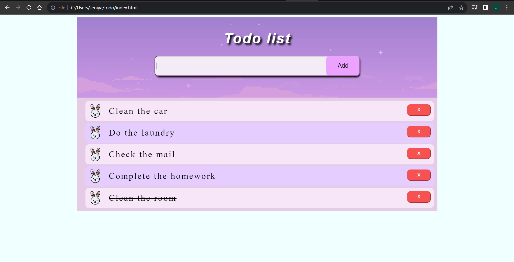

# jenitodo.github.io

# My First Todo Webpage

This repository contains the code for my first todo webpage. It's a simple web application built using HTML, CSS, and JavaScript that allows users to create, track, and manage their daily tasks.

## Features:
- **Task Management:** Add, delete, and mark tasks as complete.
- **Responsive Design:** Works seamlessly on various devices.
- **Intuitive Interface:** Easy-to-use interface for a smooth user experience.

## Technologies Used:
- HTML
- CSS
- JavaScript

## Deployment:
The project is deployed and accessible at [https://jeniya14.github.io/jenitodo.github.io/](https://jeniya14.github.io/jenitodo.github.io/).

Feel free to clone or fork this repository to explore and enhance your understanding of web development. Any feedback or contributions are welcome!
